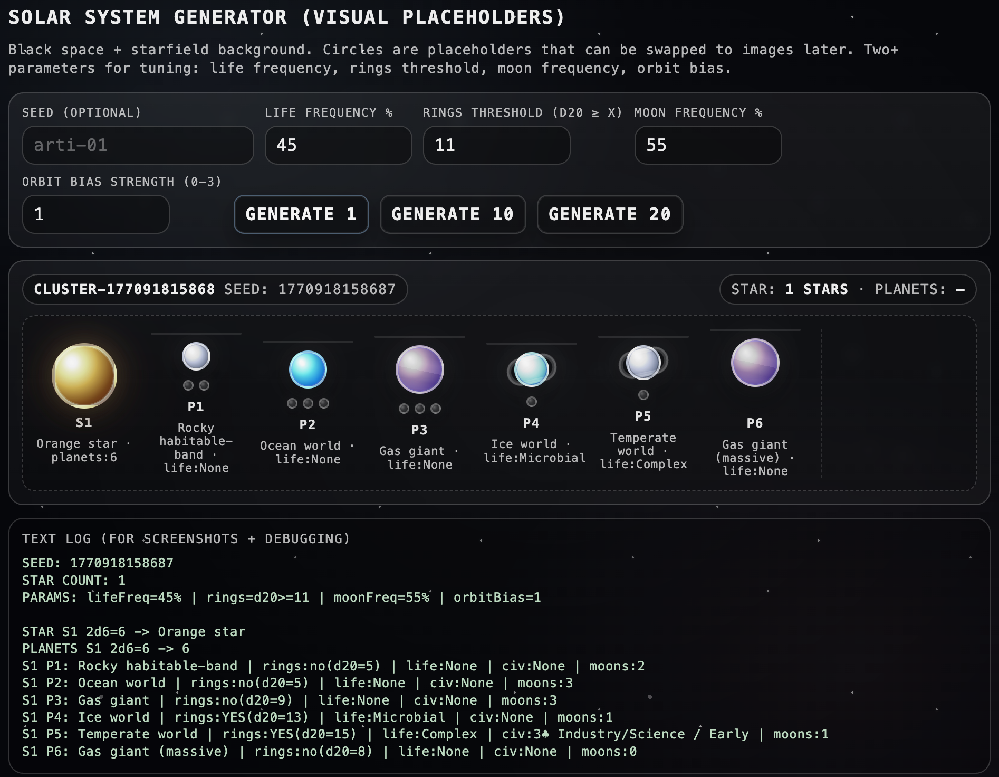
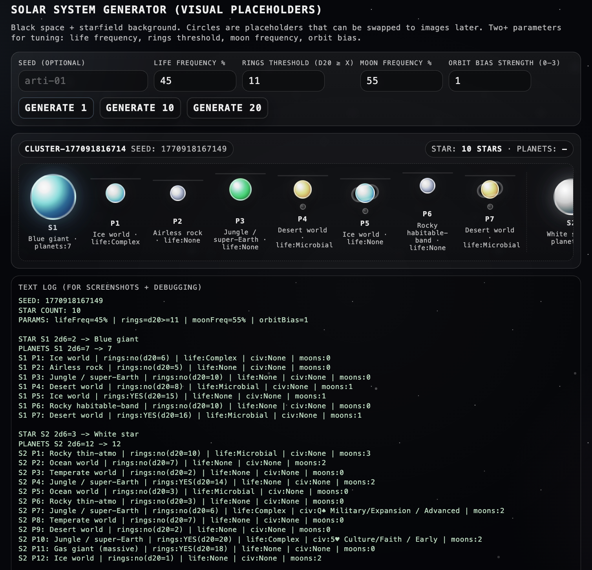
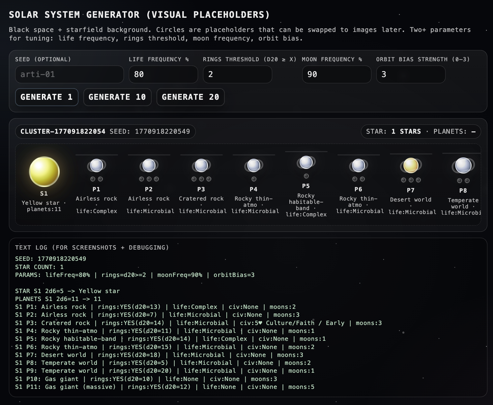
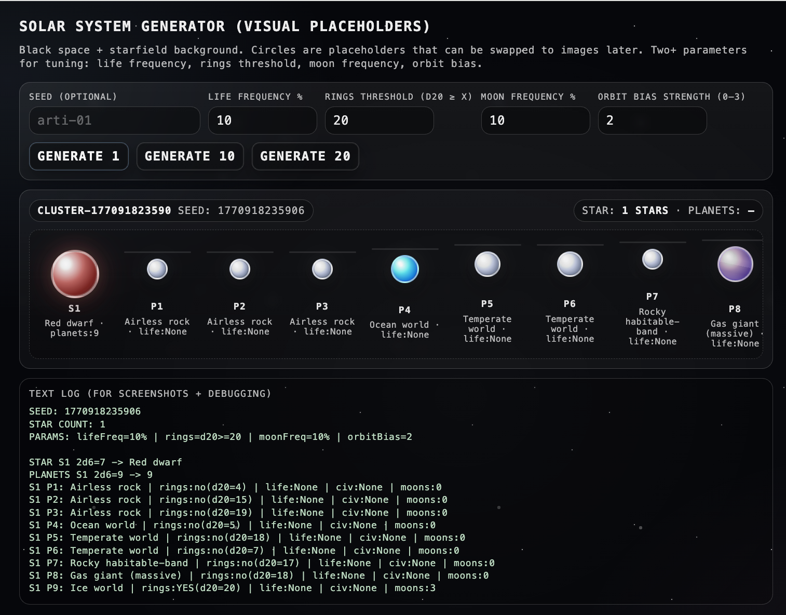

# Solar System Generator - Arti Gnanasekar

A lightweight procedural generator that creates solar system “clusters” for quick ideation. It outputs **stars + planets + moons** with readable labels and simple visuals that can later be swapped for custom art.
---
## What this tool generates

When you click **Generate**, the tool creates a **cluster** of solar systems:
- **Stars** (1, 10, or 20 depending on the button you click)
- For each star: a set of **planets** in order from inner to outer orbit
- For each planet: a **planet type** (ocean, rocky, jungle, desert, ice, gas giant, etc.)
- Optional features like:
  - **Rings** (some planets)
  - **Moons** (0–a few per planet)
  - **Life** (none / microbial / complex on non-gas planets)
  - Rare **civilization tags** (a simple “card + domain + era” descriptor)
---
## How to run / access the tool

### Option A (fastest): Open the HTML file
1. Download or locate the project file (example: `index.html`).
2. Double-click it to open in your browser.

If your browser blocks anything or it looks inconsistent, use Option B.

### Option B (recommended): Run with VSCode Live Server
1. Open the folder in **VSCode**.
2. Install the extension **Live Server**.
3. Right-click the HTML file → **Open with Live Server**.
4. A browser tab will open automatically (usually `http://127.0.0.1:5500/...`).
---
## Controls / parameters

### Seed (optional)
- **What it does:** Lets you recreate the same generated results.
- **How to use it:** Type any word/phrase (ex: `generator-01`) and click Generate.
- **Effect:** Same seed + same parameter settings = same output.

### Generate 1 / Generate 10 / Generate 20
- **What it does:** Sets the **number of stars** in the cluster.
- **Effect:**  
  - Generate 1 = one star system (easier to screenshot and inspect)  
  - Generate 10/20 = lots of systems at once (good for showing variation)

### Life frequency (%)
- **What it does:** Controls how often **life appears** on planets that are not gas giants.
- **Lower values:** Most planets have no life.
- **Higher values:** More planets show microbial/complex life.

### Rings threshold (d20 ≥ X)
- **What it does:** Controls how often planets get **rings** using a 20-sided roll.
- **Lower X (ex: 6):** Rings become common.
- **Higher X (ex: 16):** Rings become rare.

### Moon frequency (%)
- **What it does:** Controls how often planets get **moons**.
- **Lower values:** Most planets have 0 moons.
- **Higher values:** More planets display multiple moons (gas giants tend to have more).

### Orbit bias strength (0–3)
- **What it does:** Adds an orbit-based “push” so inner vs outer orbits trend differently.
- **0:** No orbit trend; fully random planet types.
- **1–3:** Stronger structure:
  - **Inner orbits** skew toward more “inner-friendly” types
  - **Outer orbits** skew toward more “outer-friendly” types  
This is meant to make systems feel a little more “organized” while staying random.
---
## Example outputs

SEED: 1770918083741
STAR COUNT: 1
PARAMS: lifeFreq=45% | rings=d20>=11 | moonFreq=55% | orbitBias=1

STAR S1 2d6=10 -> White dwarf
PLANETS S1 2d6=4 -> 4
S1 P1: Cratered rock | rings:no(d20=1) | life:None | civ:None | moons:0
S1 P2: Jungle / super-Earth | rings:no(d20=7) | life:Microbial | civ:None | moons:0
S1 P3: Temperate world | rings:no(d20=3) | life:Complex | civ:None | moons:0
S1 P4: Ocean world | rings:no(d20=5) | life:None | civ:None | moons:0

### Example Output (Variation Across Parameters)
Take 3–5 screenshots with the **same seed** but different settings:
- Life frequency: `10%` vs `80%`
- Rings threshold: `16` vs `6`
- Moon frequency: `20%` vs `90%`
- Orbit bias: `0` vs `3`

### Example Output (Batch)

---

## Known limitations (current scope)

- **Visuals are placeholders:** Planets/stars/moons are stylized circles, not real art assets yet.
- **No export button yet:** Outputs are captured via screenshots or screen recording.
- **Planet type mapping is simplified:** Some types share palettes (ex: “temperate” often counts as rocky).
- **Orbit bias is a heuristic:** It creates trends but does not simulate real astrophysics.
- **No true orbital layout:** The strip is a readable “row” visualization, not an accurate spatial simulation.
- **Civilizations are rare + simple:** The “card tag” is a placeholder descriptor, not a full generated society model.

---

## Project file structure

- `index.html`: contains all CSS + JS in one place for easy iteration.

---

## Credits / notes

- Procedural logic uses dice-style rolls (2d6 and d20) + a simple card-draw tag for civilization descriptors.
- Built as a quick prototype for midterm check-ins: focused on stability + control + expressive range but with more time make a more finalized and stylized artisitic guide. 
